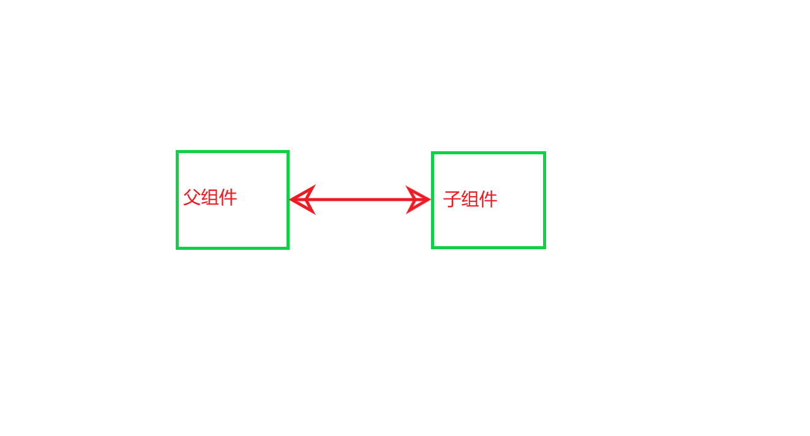
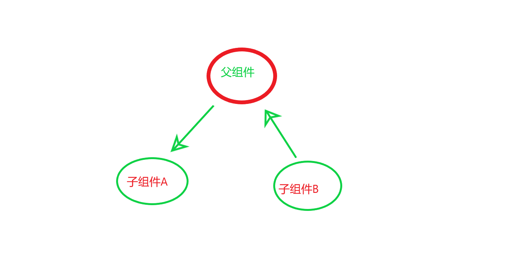
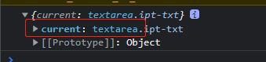
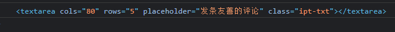

# React

## React

React 并不是一个 SPA 框架，而是一个视图库。也就 是 MVC28（Model View Controller，模型-视图-控制器.能仅仅是把组件渲染 成浏览器中的可见元素.但是，围绕 React 周边的整个生态系统让构建单页面应用成为可能。其他的第一代框架尝试一次性 解决很多问题，而 React 仅仅帮助你构建视图层。它更多的是一个库而非框架。其背后的 思路是：应用的视图应该是一系列层次分明的可组合的组件。

## JSX

### JSX到底是什么?

JSX是一种JavaScript的语法扩展，首先在[React](https://baike.baidu.com/item/React/18077599)中被进入，其格式比较像是模版语言，但事实上完全是在[JavaScript](https://baike.baidu.com/item/JavaScript/321142)内部实现的。元素是构成React应用的最小单位，JSX就是用来声明React当中的元素。React主要使用JSX来描述用户界面，但React并不强制要求使用JSX [1] ，而JSX也在React之外的框架得到了广泛的支持，包括Vue.js [3] ，Solid [2] 等。

### 在 JSX 中嵌入表达式

```js
const name = 'Josh Perez';
const element = <h1>Hello, {name}</h1>;
```

在 JSX 语法中，你可以在大括号内放置任何有效的 [JavaScript 表达式](https://developer.mozilla.org/en-US/docs/Web/JavaScript/Guide/Expressions_and_Operators#Expressions)

示例:调用 JavaScript 函数 `formatName(user)` 的结果，并将结果嵌入到 `<h1>` 元素中。

```js
import * as ReactDOM from 'react-dom/client';
const root = ReactDOM.createRoot(document.getElementById('root'));
function formatName(user) {
    return user.firstName + ' ' + user.lastName;
}

const user = {
    firstName: 'Harper',
    lastName: 'Perez'
};

const element = (
    <h1>
        Hello, {formatName(user)}!
    </h1>
);
root.render(element);//Hello, Harper Perez!
```


## 将一个元素渲染为 DOM

### 17version

```js
import React from 'react'
import ReactDOM from 'react-dom'
const title = React.createElement('h1', null, 'hello world')
ReactDOM.render(title, document.getElementById('root'))
```


### 18version

```js
import * as ReactDOM from 'react-dom/client';
const root = ReactDOM.createRoot(document.getElementById('root'));
const element = <h1>Hello world</h1>;
root.render(element);
```

```js
import * as ReactDOM from 'react-dom/client';
import App from './app'
ReactDOM.createRoot(document.getElementById('root')).render(<App/>)
```


### 深入JSX-语法糖

实际上，JSX 仅仅只是 `React.createElement(component, props, ...children)` 函数的语法糖。比如上面的 JSX 代码：

```js
<h1>Hello world</h1>
//会编译为
React.createElement('h1', null, 'hello world')
```


## 函数组件与 class 组件

### 渲染函数组件(无状态高性能)

定义组件最简单的方式就是编写 JavaScript 函数：

```js
//之前我们遇到的 React 元素都只是 DOM 标签：
const element = <div />;
//不过，React 元素也可以是用户自定义的组件：
const element = <Welcome name="Sara" />;
//当 React 元素为用户自定义组件时，它会将 JSX 所接收的属性（attributes）以及子组件（children）转换为单个对象传递给组件，这个对象被称之为 “props”。

//下面这个函数是一个有效的 React 组件，因为它接收唯一带有数据的 “props”（代表属性）对象与并返回一个 React 元素。
//这类组件被称为“函数组件”，因为它本质上就是 JavaScript 函数。
//函数组件
import * as ReactDOM from 'react-dom/client';
const root = ReactDOM.createRoot(document.getElementById('root'));
function Welcome(props) {
    // highlight-next-line
    //函数组件必须有返回值，表示该组件的 UI 结构
    //如果不需要渲染任何内容，则返回 null
    return <h1>Hello, {props.name}</h1>;
    
}
const element = <Welcome name="Sara" />;//渲染组件
root.render(element);//使用组件//Hello, Sara

//当然你可以这样去渲染一个组件
root.render(<Welcome name="Sara" />);
//Hello, Sara//效果是一样的

//组件就像HTML标签一样可以被渲染到页面中。组件表示的是一段结构内容
//对于函数组件来说，函数返回值的内容就是渲染的内容

//也可以使用双标签渲染元素
root.render(<Welcome></Welcome>);
```

让我们来看看这个函数组件渲染是怎么执行的:

1. 我们调用 `root.render()` 函数，并传入 `<Welcome name="Sara" />` 作为参数。
2. React 调用 `Welcome` 组件，并将 `{name: 'Sara'}` 作为 props 传入。
3. `Welcome` 组件将 `<h1>Hello, Sara</h1>` 元素作为返回值。
4. React DOM 将 DOM 高效地更新为 `<h1>Hello, Sara</h1>`。

:::tip 组件名称必须以大写字母开头

React 会将以小写字母开头的组件视为原生 DOM 标签。例如，`<div />` 代表 HTML 的 div 标签，而 `<Welcome />` 则代表一个组件，并且需在作用域内使用 `Welcome`。

1. 函数组件无状态(state),静态,不会发生变化(不考虑hooks的情况下)
2. 不能自己提供数据

:::

### 渲染多个组件

```js
import Hello from './hello.js'
import Home from './home.js'
//类组件
// import React from "react";
import { Component } from "react";

import * as ReactDOM from 'react-dom/client';
const root = ReactDOM.createRoot(document.getElementById('root'));
class Welcome extends Component {
    render() {
        return <h1>Hello, {this.props.name}</h1>;
    }
}
root.render(
    <>
        <Welcome name="Sara" />
        <Hello />
        <Home />
    </>
)

//hello.js
const Hello = () => <h1>Hello 你好</h1>
export default Hello
//home.js
const Home = () => <h1>这是首页</h1>
export default Home
```


### class组件(有状态)

```js
//你同时还可以使用 ES6 的 class来定义组件：
import React from "react";
import * as ReactDOM from 'react-dom/client';
const root = ReactDOM.createRoot(document.getElementById('root'));
// 定义ES6 class组件
class Welcome extends React.Component {
    render() {
        return <h1>Hello, {this.props.name}</h1>;
    }
}
root.render(<Welcome name="Sara" />)

1. 类组件应该继承 `React.Component` 父类，从而使用父类中提供的方法或属性
// highlight-start
2. 类组件必须提供 render 方法
3. render 方法必须有返回值，表示该组件的 UI 结构
4. 状态（state）是组件的私有数据
// highlight-end

//也可以单独引入Component
import {Component} from "react";
class Welcome extends Component {}
```

### class组件的状态state

```js
class Welcome extends Component {
// 为组件提供状态
    state = {
// highlight-next-line
// 从语法层面看state就是类的实例属性
        count: 0,
        list: [],
        isLoading: true
    }
    render() {
        console.log(this);// Welcome
        console.log(typeof this); //object
        return (
            // highlight-start
            // this就是当前类的实例对象
            // 交给了react,react内部回去 new 一下
            // highlight-end
            <div>计数器：{this.state.count}</div>
        )
    }
}
```


## props接收数据

函数组件:`props`接收数据

```js

import * as ReactDOM from 'react-dom/client';
// props 的值就是：{ name: 'jack', age: 19 }
function Hello(props) {//props接收数据
  return (
    <div>我叫{props.name}今年{ props.age}岁</div>
  )
}
const root = ReactDOM.createRoot(document.getElementById('root'));
root.render(<Hello name="jack" age={19} />);//传递数据
//输出:我叫jack今年19岁

```

class组件: `this.props`接收数据

```js
import React from 'react';
import * as ReactDOM from 'react-dom/client';
// props 的值就是：{ name: 'jack', age: 19 }
class Hello extends React.Component{
  render() {
    return (
      <div>我叫{this.props.name}今年{ this.props.age}岁</div>
    ) 
  }
}
const root = ReactDOM.createRoot(document.getElementById('root'));
root.render(<Hello name="jack" age={19} />);//传递数据
//输出:我叫jack今年19岁
```


## 单向数据流

:::tip 

1. **props 是只读对象**，也就是说：只能读取对象中的属性，无法修改
2. **单向数据流**，也叫做：自顶而下（自上而下）的数据流
3. 父组件中的数据可以通过 props 传递给子组件，并且，当父组件中的数据更新时，子组件就会自动接收到最新的数据
4. 类比：就像瀑布的水一样只能从上往下流动，并且，当上游的水变浑浊，下游的水也会受到影响
5. 可以传递任意数据（数字  字符串  布尔类型 数组 对象 函数 jsx）

:::

## 组件通讯



### 父到子

**步骤**：

1. 父组件提供要传递的state数据

2. 给子组件标签添加属性，值为 state 中的数据

3. 子组件中通过 props 接收父组件中传递的数据

**核心代码**

父组件提供数据并且传递给子组件

```jsx
class Parent extends React.Component {
  state = {
    money: 10000
  }
  render() {
    const { money } = this.state
    return (
      <div>
        <h1>我是父组件：{money}</h1>
        {/* 将数据传递给子组件 */}
        <Child money={money} />
      </div>
    )
  }
}
```

子组件接收数据

```jsx
function Child(props) {
	return (
  	<div>
      {/* 接收父组件中传递过来的数据 */}
    	<h3>我是子组件 -- {props.money}</h3>
    </div>
  )
}
```


### 子到父

思路和vue是一样,只不过没有vue那些语法,很直接

```js
// father.js
import { Component } from 'react'
import Child from './son'
class Parent extends Component {
  state = {
    money: 10000,
  }
// highlight-next-line
  // 1_父组件提供一个回调函数
  buyPhone = (price) => {
    console.log('父组件接收到子组件传递过来的数据:', price)
    this.setState({
      money: this.state.money - price,
    })
  }
  render() {
    const { money } = this.state
    return (
      <div>
        <h1>我是父组件：{money}</h1>
        {/* 将数据传递给子组件 */}
        <Child
          money={money}
// highlight-next-line
          // 2_将回调函数传递给子组件
          buyPhoneSon={this.buyPhone}
        />
      </div>
    )
  }
}
export default Parent
```


```js
// son.js
function Child(props) {
  console.log(props)
  // 通过打印知道子组件接收到了buyPhoneSon这个函数
  // 那么接受到了就可以调用buyPhoneSon这个函数
  return (
    <div>
      {/* 接收父组件中传递过来的数据 */}
      <h3>我是子组件 -- {props.money}</h3>
      <button
// highlight-next-line
        // 3_子组件调用父组件传递过来的回调，并且将要传递的数据，作为参数传递
        onClick={() => props.buyPhoneSon(100)}
      >
        买手机用爸爸的钱
      </button>
    </div>
  )
}
export default Child

```

```js
// 类组件子传父
import { Component } from 'react'
class Child extends Component {
  render() {
    const { buyPhoneSon } = this.props
    return (
      <div>
        <button
          // 3_子组件调用父组件传递过来的回调，并且将要传递的数据，作为参数传递
          onClick={() => buyPhoneSon(100)}
        >
          买200元手机用爸爸的钱
        </button>
      </div>
    )
  }
}
export default Child
// highlight-start
// 总结：
// 1. 父组件如何接收子组件传递过来的数据？ 
//    回调函数的参数
// 2. 子组件如何传递数据给父组件？ 
//    调用回调时传入的参数
// 3. 父组件状态更新后，子组件拿到的数据是否自动更新了？ 
//    会自动更新，这是 单向数据流 的体现
// highlight-end
```

### 兄各组件--状态提升




```js
// 父组件
import { Component } from 'react'
// 导入两个子组件
import Jack from './Jack'
import Rose from './Rose'

// App 是父组件
class App extends Component {
  // 1. 状态提升到父组件
  state = {
    msg: '',
  }

  changeMsg = (msg) => {
    this.setState({
      msg,
    })
  }

  render() {
    return (
      <div>
        <h1>我是App组件</h1>
        {/* 兄弟组件 1 */}
        <Jack say={this.changeMsg}></Jack>
        {/* 兄弟组件 2 */}
        <Rose msg={this.state.msg}></Rose>
      </div>
    )
  }
}
export default App

```

```js
// 子组件 Jack.js
import React, { Component } from 'react'

export default class Jack extends Component {
  say = () => {
    // 修改数据
    this.props.say('you jump i jump')
  }
  render() {
    return (
      <div>
        <h3>我是Jack组件</h3>
        <button onClick={this.say}>说</button>
      </div>
    )
  }
}
```

```js
// 子组件Rose.js
import React, { Component } from 'react'

export default class Rose extends Component {
  render() {
    return (
      <div>
        {/* 展示数据 */}
        <h3>我是Rose组件-{this.props.msg}</h3>
      </div>
    )
  }
}

```


### 跨组件通讯--Context

## React核心思想:状态不可变

:::tip 注意

***状态不可变并不是指的状态不能变,而是不要直接修改状态的值，是基于当前状态创建新的状态值***

**状态不可变也可以叫单向数据流**

:::

**不要直接修改 State**.**而是应该使用** `setState()`.**构造函数是唯一可以给 `this.state` 赋值的地方。**

### this.setState修改状态的唯一方式

react唯一修改状态的方式就是`this.setState`

- 思想：**数据驱动视图**，也就是只需要修改数据（状态）那么页面（视图）就会自动刷新
  - 核心：数据！！！
  - 从现在开始，我们关心的是如何修改数据，而不再是关心如何修改DOM
  - 并且，注意：尽量避免直接手动 DOM（通过 document.querySelector() 获取到到DOM对象然后再操作） 操作！！！
- 注意：*不要直接修改 state 中的值，这是无效的*！

### state注意事项

```js
state = {
  count: 0,
  list: [1, 2, 3],
  person: {
    name: 'jack',
    age: 18
  }
}

// 【不推荐】直接修改当前值的操作：
this.state.count++
++this.state.count
this.state.count += 1
this.state.count = 1

// 只要是数组中直接修改当前数组的方法都不能用！
this.state.list.push(123)

this.state.person.name = 'rose'
// highlight-next-line
// 【推荐】不是直接修改当前值，而是创建新值的操作：
this.setState({
  count: this.state.count + 1,
  list: [...this.state.list, 123],
  person: {
    ...this.state.person,
      // highlight-next-line
    // 要修改的属性，会覆盖原来的属性，这样，就可以达到修改对象中属性的目的了
    name: 'rose'
  }
})
```

### setState

```js
import * as ReactDOM from 'react-dom/client';
import React from 'react';
// import './index.css'
// import Comments from './Comments.js'
const list = [
  {
    title: 'React',
    url: 'https://facebook.github.io/react/',
    author: 'Jordan Walke',
    num_comments: 3,
    points: 4,
    objectID: 0,
  },
];

class App extends React.Component {
  constructor(props) {
    super(props);
    this.state = {
      list: list,
    };
    this.onDismiss = this.onDismiss.bind(this)
  }

  onDismiss(id) {
    const isNotId = item => item.objectID !== id;
    const updatedList = this.state.list.filter(isNotId);
      // highlight-next-line
    this.setState({ list: updatedList });

  }

  render() {
    return (
      <div className="App">
        {this.state.list.map(item =>
          <div key={item.objectID}>
            <span>
              <a href={item.url}>{item.title}</a>
            </span>
            <span>{item.author}</span>
            <span>{item.num_comments}</span>
            <span>{item.points}</span>
            <span>
              <button
                onClick={() => this.onDismiss(item.objectID)}
                type="button"
              >
                Dismiss
              </button>
            </span>
          </div>
        )}
      </div>
    );
  }
}
const root = ReactDOM.createRoot(document.getElementById('root'));
root.render(<App />);
```

## 事件

JSX中最好不要包含太多的逻辑,可以抽离到单独的函数中

## 受控组件-表单

受控组件：**value值受到了react状态控制的表单元素** 

### onChange

```js
import * as ReactDOM from 'react-dom/client';
import React from 'react';
class App extends React.Component {
    state = {
        msg: 'hello react'
    }

    handleChange = (e) => {
        // highlight-next-line
        this.setState({
            msg: e.target.value//最新值
        })
    }

    render() {
        return (
            <div>
                <input
                    type="text"
                    value={this.state.msg}
					// highlight-next-line
                    onChange={this.handleChange}//关键
                />
            </div>
        )
    }
}
const root = ReactDOM.createRoot(document.getElementById('root'));
root.render(<App />);
            
//表单value的更新过程:
// highlight-start
1. 在文本框输入内容后,会触发文本框的onChange事件
2. onChange事件触发,handleChange中的代码执行
3. handleChange执行后拿到文本框最新的值(e.target.value)
4. 将最新的文本框值交给了setState ,setState更新了状态
5. 调用setState后状态会更新,同时,组件会重新渲染,会重新调用render
6. render重新调用就拿到了文本框最新的值,并且把最新的文本框值渲染到页面上
7. 此时,就看到文本框变化了
// highlight-end
```

### 非受控组件-ref

```js
// 1 导入 createRef 函数（ 用来创建 ref 对象 ）
import { createRef, Component } from 'react'
class Hello extends Component {
    // highlight-next-line
//调用 createRef 函数来创建一个 ref 对象
//ref 对象的名称（txtRef）可以是任意值
//命名要规范： txt（DOM 元素的自己标识） + Ref
    // highlight-next-line
    txtRef = createRef()
    handleClick = () => {
        // 文本框对应的 DOM 元素
        // console.log(this.txtRef.current)

        // 4 获取文本框的值：
        // highlight-next-line
        console.log(this.txtRef.current.value)
    }
    render() {
        return (
            <div>
                <input ref={this.txtRef} />
                <button onClick={this.handleClick}>获取文本框的值</button>
            </div>
        )
        //将创建好的 ref 对象，设置为 input 标签的 ref 属性值
        //作用：将 ref 和 input DOM 绑定到一起，将来在通过 this.txtRef 拿到的就是当前 DOM 对象
    }
}
// highlight-next-line
// 非受控组件借助ref,使用原生DOM的方式来获取表单元素的值 
```

**注意:**

1. ref是个对象,对象中有一个current属性
2. current属性的值才是DOM对象

**打印结果:**

```js
// highlight-next-line
console.log(this.txtRef);
```



```js
// highlight-next-line
console.log(this.txtRef.current);
```



> **尽量避免使用这种方式**

**非受控组件借助ref,使用原生DOM的方式来获取表单元素的值**

- 非受控组件通过React组件的状态来控制表单元素的值
- 手动操作DOM来控制
- ref: 用来在React中获取DOM元素

**何时使用 Refs:**

- 管理焦点，文本选择或媒体播放。
- 触发强制动画。
- 集成第三方 DOM 库。


## Hooks

[hooks官网文档](https://zh-hans.reactjs.org/docs/hooks-intro.html)

**hook指的就是一个特殊的函数** **以use开头**

为**函数组件**提供状态、生命周期等原本 class 组件中提供的 React 功能

- 可以理解为通过 Hooks 为函数组件钩入 class 组件的特性

:::tip注意

Hooks 只能在函数组件中使用，自此，函数组件成为 React 的新宠儿

:::


### 为什么要有 Hooks  

两个角度：1 组件的状态逻辑复用  2 class 组件自身的问题

1. 组件的状态逻辑复用：
   + 在 Hooks 之前，组件的状态逻辑复用经历了：mixins（混入）、HOCs（高阶组件）、render-props 等模式
   + （早已废弃）mixins 的问题：1 数据来源不清晰 2 命名冲突
   + HOCs、render-props 的问题：重构组件结构，导致组件形成 JSX 嵌套地狱问题

2. class 组件自身的问题：
   + 选择：函数组件和 class 组件之间的区别以及使用哪种组件更合适
   + 需要理解 class 中的 this 是如何工作的,有了箭头函数后好很多
   + 相互关联且需要对照修改的代码被拆分到不同生命周期函数中

- 相比于函数组件来说，不利于代码压缩和优化，也不利于 TS 的类型推导

Hooks 来解决这些问题

### hooks渐进策略

+ react没有计划从React中移除 class [文档](https://zh-hans.reactjs.org/docs/hooks-intro.html)
+ Hooks 和现有代码可以同时工作，你可以渐进式地使用他们
  + 不推荐直接使用 Hooks 大规模重构现有组件 
  + 推荐：新功能用 Hooks，复杂功能实现不了的，也可以继续用 class
  + 找一个功能简单、非核心功能的组件开始使用 hooks
+ 之前的react语法并不是以后就不用了
  + class 组件相关的 API 在hooks中可以不用
    + class 自身语法，比如，constructor、static 等
    + 钩子函数，`componentDidMount`、`componentDidUpdate`、`componentWillUnmount`
    + `this` 相关的用法
  + **原来的 React 内容还是要用的**
    + JSX：`{}`、`onClick={handleClick}`、条件渲染、列表渲染、样式处理等
    + 组件：函数组件、组件通讯
    + React 开发理念：`单向数据流`、`状态提升` 等
    + 解决问题的思路、技巧、常见错误的分析等

**总结**：

1. react没有计划从React中移除class
2. react将继续为 class 组件提供支持
3. 可以在项目中同时使用hooks和class


### useState-基本使用 

**hook指的就是一个特殊的函数** **以use开头**

:::tip 注意

参数0指定状态state初始值,如果没有初始状态,state为undefined,去修改state会变成NaN

打印出来这是一个数组

索引  0 为state状态值

索引 1 表示：修改状态的函数（setState）

:::

:::tip 注意
useState hook 的参数可以是任意值
:::

```js
import { useState } from "react";
import * as ReactDOM from "react-dom/client";
function Example() {
  const [count, setCount] = useState(0); //数组解构
  return (
    <div>
      {/* 展示状态值 */}
      <p>You clicked {count} times</p>
      {/* 点击按钮，让状态值 +1 */}
      <button onClick={() => setCount(count + 1)}>Click me</button>
    </div>
  );
}
const root = ReactDOM.createRoot(document.getElementById("root"));
root.render(<Example />);
```


setCount 的打印结果

```
ƒ dispatchSetState(fiber, queue, action) {
      {
        if (typeof arguments[3] === 'function') {
          error("State updates from the useState() and useReducer() Hooks don't support the " + 'sec…
```

也可以这样写 就一个解构的区别:


```js
const Count = () => {  
  const stateArray = useState()
  const state = stateArray[0]
  const setState = stateArray[1]
  return (
    <div>
      <h1>状态为：{state}</h1>
      <button onClick={() => setState(state + 1)}>+1</button>
    </div>
  )
}
```

来看下上面这个useState组件的更新过程

- 组件第一次渲染：
  1. 从头开始执行该组件中的代码逻辑
  2. 调用 `useState(0)` 将传入的参数作为状态初始值，即：0
  3. 渲染组件，此时，获取到的状态 count 值为： 0

- 组件第二次渲染：
  1. 点击按钮，调用 `setCount(count + 1)` 修改状态，因为状态发生改变，所以，该组件会重新渲染
  2. 组件重新渲染时，会再次执行该组件中的代码逻辑
  3. 再次调用 `useState(0)`，此时 **React 内部会拿到最新的状态值而非初始值**，比如，该案例中最新的状态值为 1
  4. 再次渲染组件，此时，获取到的状态 count 值为：1

注意：**useState 的初始值(参数)只会在组件第一次渲染时生效**。

也就是说，以后的每次渲染，useState 获取到都是最新的状态值。React 组件会记住每次最新的状态值！

### useState的读取和使用

```js
import { useState } from "react";
import * as ReactDOM from "react-dom/client";
//Counter组件
const Counter = () => {
  //初始值为一个对象
  const [user, setUser] = useState({ name: "jack", age: 18 });
  console.log(user);
  console.log(useState({ name: "jack", age: 18 }));

  const handleClick = () => {
    setUser({
      //新的状态值会覆盖原来的值
      ...user,
      age: user.age+2
    })
  }
  return (
    <div>
      <p>姓名：{user.name}</p>
      <p>年龄：{user.age}</p>
      <button onClick={handleClick} > 修改年龄 </button>
    </div>
  );
};
const root = ReactDOM.createRoot(document.getElementById("root"));
root.render(<Counter />);
```

### useEffect 副作用介绍

`side effect`：副作用

使用场景：当你想要在函数组件中，**处理副作用（side effect）时**，就要使用 **useEffect** Hook 了
作用：**处理函数组件中的副作用（side effect）**

问题：副作用（side effect）是什么? 
回答：在计算机科学中，如果一个函数或其他操作修改了其局部环境之外的状态变量值，那么它就被称为有副作用
类比，对于 999 感冒灵感冒药来说：

- （主）作用：用于感冒引起的头痛，发热，鼻塞，流涕，咽痛等 
- 副作用：可见困倦、嗜睡、口渴、虚弱感

理解：副作用是相对于主作用来说的，一个功能（比如，函数）除了主作用，其他的作用就是副作用
对于 React 组件来说，**主作用就是根据数据（state/props）渲染 UI**，除此之外都是副作用（比如，手动修改 DOM）

常见的副作用（side effect）：数据（Ajax）请求、手动修改 DOM、localStorage、console.log 操作等

**总结**：

​	对于react组件来说，除了渲染UI之外的其他操作，都可以称之为副作用


### useEffect-基本使用

**目标：**能够在函数组件中操作DOM（处理副作用）

**内容：**

使用场景：当你想要在函数组件中，处理副作用（side effect）时就要使用 useEffect Hook 了

作用：处理函数组件中的一些副作用（side effect）

注意：在实际开发中，副作用是不可避免的。因此，react 专门提供了 **useEffect** Hook **来处理函数组件中的副作用**

语法：

- **参数**：**回调函数**（称为 **effect**），就是**在该函数中写副作用代码**
- 执行时机：该 effect 会在组件第一次渲染以及每次组件更新后执行
- 相当于 componentDidMount + componentDidUpdate


先调用useEffect( )函数

```
useEffect( )
```

useEffect ( 参数) 参数是个回调函数

第一个参数就是effect函数

```js
useEffect(function effect() {
  document.title = `当前已点击 ${count} 次`
})
```

当然也可以写箭头函数

```js
useEffect(() => {
  document.title = `当前已点击 ${count} 次`
})
```


示例：

```jsx
import { useEffect } from 'react'

const Counter = () => {
  const [count, setCount] = useState(0)
  
  useEffect(() => {
    document.title = `当前已点击 ${count} 次`
  })
  
  return (
  	<div>
    	<h1>计数器：{count}</h1>
      <button onClick={() => setCount(count + 1)}>+1</button>
    </div>
  )
}
```

### useEffect第二个参数

***第二个参数相当于vue中的 watch监听***

**目标：**能够设置 useEffect 的依赖只在 count 变化时执行相应的 effect

**内容：**

- 问题：如果组件中有另外一个状态，另一个状态更新时，刚刚的 effect 回调也会执行 
- 默认情况：只要状态发生更新 useEffect 的 effect 回调就会执行
- 性能优化：**跳过不必要的执行，只在 count 变化时，才执行相应的 effect**

- 语法：
  - 第二个参数：可选，也可以传一个数组，数组中的元素可以成为依赖项（deps） 
  - 该示例中表示：只有当 count 改变时，才会重新执行该 effect

```js
  useEffect(() => {
    document.title = `当前已点击 ${count} 次`
  }, [count])
```

**核心代码：**

```js
import * as ReactDOM from "react-dom/client";
import { useEffect, useState } from "react";
const Counter = () => {
  const [count, setCount] = useState(0);
  const [loading, setLoading] = useState(false);
  
  useEffect(() => {
    console.log('conut', count);
    document.title = `当前已点击 ${count} 次`;
  }, [count]);
//跳过不必要的执行，只在 count 变化时，才执行相应的 effect

  return (
    <div>
      <h1>计数器：{count}</h1>
      <button onClick={() => setCount(count + 1)}>+1</button>
      <br />
      <div> {loading? '加载中' : '加载完成!' }</div>
      <button onClick={() => setLoading(!loading)}>切换 loading</button>
    </div>
  );
};

const root = ReactDOM.createRoot(document.getElementById("root"));
root.render(<Counter />);
```

### 第二个参数是一个空数组

**目标：**能够设置useEffect的依赖，让组件只有在第一次渲染后会执行

**内容**：

- useEffect 的第二个参数，还可以是一个**空数组（[]）**，表示只在组件第一次渲染后执行 effect

- 使用场景：1 事件绑定  2 发送请求获取数据 等

- 语法：
  - 该 effect 只会在组件第一次渲染后执行，因此，可以执行像事件绑定等只需要执行一次的操作
  - 此时，相当于 class 组件的 componentDidMount 钩子函数的作用

```js
useEffect(() => {
  const handleResize = () => {}
  window.addEventListener('resize', handleResize)
}, [])
```

注意：

- 跟 useState Hook 一样，一个组件中也可以调用 useEffect Hook 多次 
- 推荐：**一个 useEffect 只处理一个功能，有多个功能时，使用多次 useEffect**


### useEffect发送请求

+ 在组件中，可以使用 useEffect Hook 来发送请求（side effect）获取数据

+ 注意：**effect 只能是一个同步函数，不能使用 async**
  + 因为如果 effect 是 async 的，此时返回值是 Promise 对象。这样的话，就无法保证清理函数被立即调用
+ 为了使用 async/await 语法，可以在 effect 内部创建 async 函数，并调用

**核心代码：**

```jsx
// 错误演示：不要给 effect 添加 async
useEffect(async () => {
  const res = await axios.get('http://xxx')
  return () => {}
}, [])

// 正确使用
useEffect(() => {
  const loadData = async () => {
    const res = await axios.get('http://xxx')
  }
  loadData()
  
  return () => {}
}, [])
```


