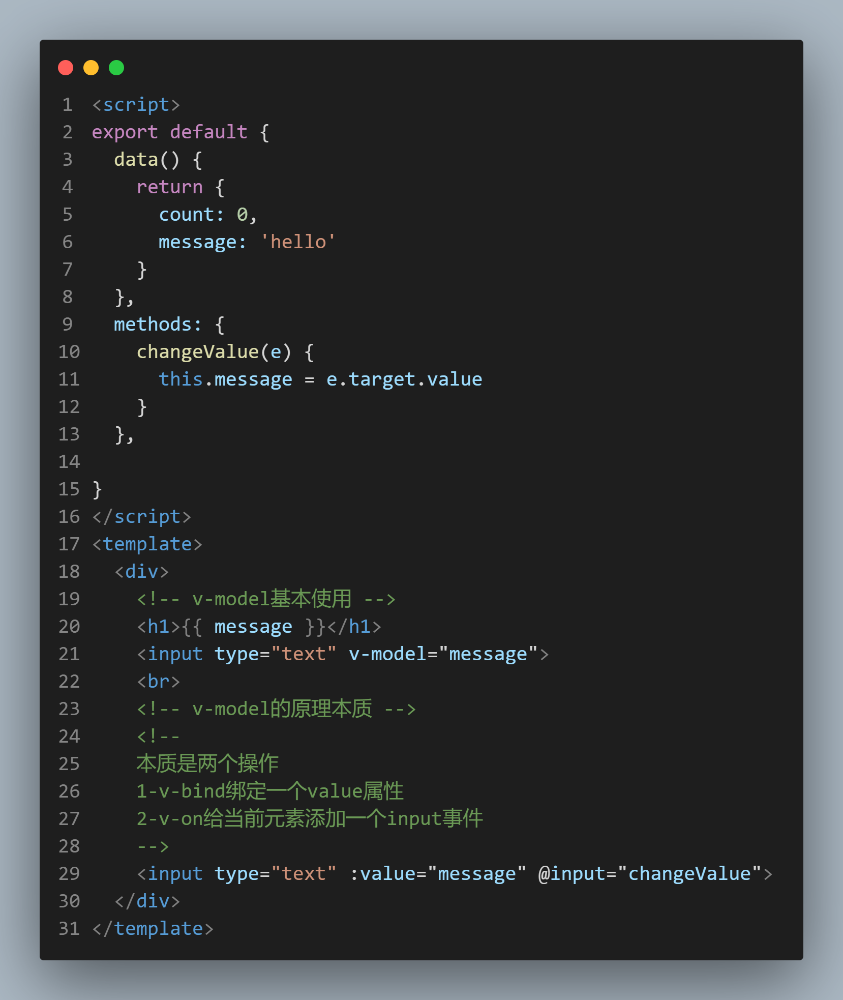

# Vue2第一章_指令

## Vite+Vue2

[第三方教程地址](https://cloud.tencent.com/developer/article/1982530)

**Vite 为 Vue 提供第一优先级支持：**

- Vue 3 单文件组件支持：[@vitejs/plugin-vue](https://github.com/vitejs/vite/tree/main/packages/plugin-vue)
- Vue 3 JSX 支持：[@vitejs/plugin-vue-jsx](https://github.com/vitejs/vite/tree/main/packages/plugin-vue-jsx)
- Vue 2 支持：[vitejs/vite-plugin-vue2](https://github.com/vitejs/vite-plugin-vue2)
- Vue <2.7 的支持：[underfin/vite-plugin-vue2](https://github.com/underfin/vite-plugin-vue2)

**Vite+Vue2配置:**

```json
// package.json
"vue-template-compiler": "^2.7.8",
"@vitejs/plugin-vue2": "^1.1.2",
```

```js
// vite.config.js
import { defineConfig } from "vite";
import vue from '@vitejs/plugin-vue2'
export default defineConfig({
  plugins: [vue()]
});

```


**目录**

```bash
 vuecil-demo        # 项目目录
    ├── node_modules # 项目依赖的第三方包
    ├── public       # 静态文件目录
      ├── favicon.ico# 浏览器小图标
      └── index.html # 单页面的html文件(网页浏览的是它)
    ├── src          # 业务文件夹
      ├── assets     # 静态资源
        └── logo.png # vue的logo图片
      ├── components # 组件目录
        └── HelloWorld.vue # 欢迎页面vue代码文件 
      ├── App.vue    # 整个应用的根组件
      └── main.js    # 入口js文件
    ├── .gitignore   # git提交忽略配置
    ├── babel.config.js  # babel配置
    ├── package.json  # 依赖包列表
    ├── README.md    # 项目说明
	└── yarn.lock    # 项目包版本锁定和缓存地址
```

## 简单上手

```js
// 项目入口-webpack打包从这开始
// main.js
import Vue from "vue"; // 引入vue源码
import App from "./App.vue"; // 引入App.vue文件模块
Vue.config.productionTip = false; // 一个控制台打印的提示
new Vue({
  // 实例化Vue(传入配置对象)
  render: (h) => h(App), // 告诉vue渲染什么
}).$mount("#app"); // '渲染到哪里
```

**.vue单文件组件SFC**

`.vue` 文件是使用类 HTML 语法来描述 Vue 组件的一种自定义文件格式。每一个 `.vue` 文件都由三种类型的顶层语法块所组成：`<template>`、`<script>`、`<style>` 以及可选的附加自定义块：

`<script>`

- 每一个 `*.vue` 文件最多可同时包含一个 `<script>` 块 (不包括[``](https://v3.cn.vuejs.org/api/sfc-script-setup.html))。
- 该脚本将作为 ES Module 来执行。
- 其**默认导出**的内容应该是 Vue 组件选项对象，它要么是一个普通的对象，要么是 [defineComponent](https://v3.cn.vuejs.org/api/global-api.html#definecomponent) 的返回值

```html
<!-- template必须, 只能有一个根标签, 影响渲染到页面的标签结构 -->
<template>
  <div>欢迎使用vue</div>
</template>

<!-- js相关 -->
<script>
export default {
  name: 'App'
}
</script>

<!-- 当前组件的样式, 设置scoped, 可以保证样式只对当前页面有效 -->
<style scoped>
</style>

```


## 1__指令

### 自定义指令`Vue.directive`

在 Vue2.0 中，代码复用和抽象的主要形式是组件。然而，有的情况下，你仍然需要`对普通 DOM 元素进行底层操作`，这时候就会用到自定义指令。举个聚焦输入框的例子，如下：

```js
// 注册一个全局自定义指令 `v-focus`
Vue.directive('focus', {
  // 当被绑定的元素插入到 DOM 中时……
  inserted: function (el) {
    // 聚焦元素
    el.focus()
  }
})
```


### 插值表达式

:::tip 语法和目的

语法: {{ 表达式 }} 

目的: 在dom标签中, 直接插入内容

::: 

### v-bind 

**js中的data - 自定义属性**

:::tip v-bind

字面意思:捆绑,绑定

语法:  v-bind:属性名="vue变量"

简写：:属性名="vue变量"

把vue变量的值, 赋予给dom属性上, 影响标签显示效果

:::

```html
<!-- vue指令-v-bind属性动态赋值 -->
<!-- 完整语法 -->
<a v-bind:href="url">...</a>

<!-- 缩写 -->
<a :href="url">...</a>

<!-- 动态参数的缩写 (2.6.0+) -->
<a :[key]="url"> ... </a>
```

### v-on

:::tip 语法

* v-on:事件名="要执行的==少量代码=="
* v-on:事件名="methods中的函数"
* v-on:事件名="methods中的函数(实参)"
* 简写: @事件名="methods中的函数"

:::

```html
<!-- vue指令:   v-on事件绑定-->
<p>你要买商品的数量: {{count}}</p>
<button v-on:click="count = count + 1">增加1</button>
<button v-on:click="addFn">增加1个</button>
<button v-on:click="addCountFn(5)">一次加5件</button>

<button @click="subFn">减少</button>

<script>
    export default {
        // ...其他省略
        methods: {
            addFn(){ // this代表export default后面的组件对象(下属有data里return出来的属性)
                this.count++
            },
            addCountFn(num){
                this.count += num
            },
            subFn(){
                this.count--
            }
        }
    }
</script>
```

### v-on事件对象

:::tip 事件对象+参数

绑定事件,即传递参数,也有事件对象

使用`$event`

:::

```html
<div @click="addCount(5,$event)">{{counter}}</div>
```


* 语法:
  * 无传参, 通过形参直接接收
  * 传参, 通过$event指代事件对象传给事件处理函数

```html
<template>
  <div>
    <a @click="one" href="http://www.baidu.com">阻止百度</a>
    <hr>
    <a @click="two(10, $event)" href="http://www.baidu.com">阻止去百度</a>
  </div>
</template>

<script>
export default {
  methods: {
    one(e){
      e.preventDefault()
    },
    two(num, e){
      e.preventDefault()
    }
  }
}
</script>
```

### v-on修饰符

:::tip 语法

@事件名.修饰符="methods里函数"

* .stop - 阻止事件冒泡
* .prevent - 阻止默认行为
* .once - 程序运行期间, 只触发一次事件处理函数

:::

```html
<template>
  <div @click="fatherFn">
    <!-- vue对事件进行了修饰符设置, 在事件后面.修饰符名即可使用更多的功能 -->
    <button @click.stop="btn">.stop阻止事件冒泡</button>
    <a href="http://www.baidu.com" @click.prevent="btn">.prevent阻止默认行为</a>
    <button @click.once="btn">.once程序运行期间, 只触发一次事件处理函数</button>
  </div>
</template>

<script>
export default {
  methods: {
    fatherFn(){
      console.log("father被触发");
    },
    btn(){
      console.log(1);
    }
  }
}
</script>
```


### v-on按键修饰符

> 目标: 给键盘事件, 添加修饰符, 增强能力

语法:

* @keyup.enter  -  监测回车按键
* @keyup.esc     -   监测返回按键

```html
<template>
  <div>
    <input type="text" @keydown.enter="enterFn">
    <hr>
    <input type="text" @keydown.esc="escFn">
  </div>
</template>

<script>
export default {
 methods: {
   enterFn(){
     console.log("enter回车按键了");
   },
   escFn(){
     console.log("esc按键了");
   }
 }
}
</script>
```


### v-model本质

```html
<script>
export default {
  data() {
    return {
      count: 0,
      message: 'hello'
    }
  },
  methods: {
    changeValue(e) {
      this.message = e.target.value
    }
  },

}
</script>
<template>
  <div>
    <!-- v-model基本使用 -->
    <h1>{{ message }}</h1>
    <input type="text" v-model="message">
    <br>
    <!-- v-model的原理本质 -->
    <!-- 
    本质是两个操作
    1-v-bind绑定一个value属性
    2-v-on给当前元素添加一个input事件
    -->
    <input type="text" :value="message" @input="changeValue">
  </div>
</template>
```





###  v-model 双向数据绑定

:::tip v-model绑定谁?

绑定 **data数据** 和 **表单标签value属性**

:::

你可以用 v-model 指令在表单 `<input>`、`<textarea>` 及 `<select>` 元素上创建双向数据绑定。它会根据控件类型自动选取正确的方法来更新元素。尽管有些神奇，但 `v-model` 本质上不过是语法糖。它负责监听用户的输入事件来更新数据，并在某种极端场景下进行一些特殊处理。


`v-model` 在内部为不同的输入元素使用不同的 property 并抛出不同的事件：

- text 和 textarea 元素使用 `value` property 和 `input` 事件；
- checkbox 和 radio 使用 `checked` property 和 `change` 事件；
- select 字段将 `value` 作为 prop 并将 `change` 作为事件。

:::tip v-model

目标: 把value属性和vue数据变量, 双向绑定到一起

语法: v-model="vue数据变量"

双向数据绑定:

* 数据变化 -> 视图自动同步
* 视图变化 -> 数据自动同步

:::

```html
<template>
  <div>
    <!-- 
    	v-model:是实现vuejs变量和表单标签value属性, 双向绑定的指令
    -->
    <div>
      <span>用户名:</span>
      <input type="text" v-model="username" />
    </div>
    <div>
      <span>密码:</span>
      <input type="password" v-model="pass" />
    </div>
    <div>
      <span>来自于: </span>
      <!-- 下拉菜单要绑定在select上 -->
      <select v-model="from">
        <option value="北京市">北京</option>
        <option value="南京市">南京</option>
        <option value="天津市">天津</option>
      </select>
    </div>
    <div>
      <!-- (重要)
      遇到复选框, v-model的变量值
      非数组 - 关联的是复选框的checked属性
      数组   - 关联的是复选框的value属性
       -->
      <span>爱好: </span>
      <input type="checkbox" v-model="hobby" value="抽烟">抽烟
      <input type="checkbox" v-model="hobby" value="喝酒">喝酒
      <input type="checkbox" v-model="hobby" value="写代码">写代码
    </div>
    <div>
      <span>性别: </span>
      <input type="radio" value="男" name="sex" v-model="gender">男
      <input type="radio" value="女" name="sex" v-model="gender">女
    </div>
    <div>
      <span>自我介绍</span>
      <textarea v-model="intro"></textarea>
    </div>
  </div>
</template>

<script>
export default {
  data() {
    return {
      username: "",
      pass: "",
      from: "",
      hobby: [], 
      sex: "",
      intro: "",
    };
    // 总结:
    // 特别注意: v-model, 在input[checkbox]的多选框状态
    // 变量为非数组, 则绑定的是checked的属性(true/false) - 常用于: 单个绑定使用
    // 变量为数组, 则绑定的是他们的value属性里的值 - 常用于: 收集勾选了哪些值
  }
};
</script>
```

### v-text & v-html


目的: 更新DOM对象的 innerText  /  innerHTML

语法:

* v-text="vue数据变量"    
* v-html="vue数据变量"

注意: 会覆盖插值表达式

```html
<template>
  <div>
    <p v-text="str"></p>
    <p v-html="str"></p>
  </div>
</template>

<script>
export default {
  data() {
    return {
      str: "<span>我是一个span标签</span>"
    }
  }
}
</script>
```

### v-show & v-if

语法:

* v-show="vue变量"            
* v-if="vue变量" 
* 频繁切换显示用v-show,否则就用v-if

原理

* v-show 用的display:none隐藏   (频繁切换使用)
* v-if  直接从DOM树上移除

高级

* v-else使用

```html
<template>
  <div>
    <h1 v-show="isOk">v-show的盒子</h1>
    <h1 v-if="isOk">v-if的盒子</h1>

    <div>
      <p v-if="age > 18">我成年了</p>
      <p v-else>还得多吃饭</p>
    </div>
  </div>
</template>

<script>
export default {
  data() {
    return {
      isOk: true,
      age: 15
    }
  }
}
</script>
```

```bash
npm i less less-loader
```

**取反操作显示隐藏**

```html
<template>
  <div>
    <button @click="toggle"> 切换</button>
    <div class="box" v-show="showBox"></div>
  </div>
</template>
<script>
export default {
  data() {
    return {
      showBox: true
    }
  },
  methods: {
    toggle() {
      this.showBox = !this.showBox
    }
  },
}
</script>
<style>
.box {
  border: 2px solid red;
  width: 200px;
  height: 200px;
}
</style>
```


```html
<template>
  <div id="app">
    <h3>案例：折叠面板</h3>
    <div>
      <div class="title">
        <h4>芙蓉楼送辛渐</h4>
        <span class="btn" @click="isShow = !isShow" >
          收起
        </span>
      </div>
      <div class="container" v-show="isShow">
        <p>寒雨连江夜入吴,</p>
        <p>平明送客楚山孤。</p>
        <p>洛阳亲友如相问，</p>
        <p>一片冰心在玉壶。</p>
      </div>
    </div>
  </div>
</template>

<script>
export default {
  data() {
    return {
      isShow: false
    }
  }
}
</script>

<style lang="less">
body {
  background-color: #ccc;
  #app {
    width: 400px;
    margin: 20px auto;
    background-color: #fff;
    border: 4px solid blueviolet;
    border-radius: 1em;
    box-shadow: 3px 3px 3px rgba(0, 0, 0, 0.5);
    padding: 1em 2em 2em;
    h3 {
      text-align: center;
    }
    .title {
      display: flex;
      justify-content: space-between;
      align-items: center;
      border: 1px solid #ccc;
      padding: 0 1em;
    }
    .title h4 {
      line-height: 2;
      margin: 0;
    }
    .container {
      border: 1px solid #ccc;
      padding: 0 1em;
    }
    .btn {
      /* 鼠标改成手的形状 */
      cursor: pointer;
    }
  }
}
</style>
```


### v-for

#### v-for遍历数组

:::tip 遍历数组的键值

第一个参数为`被迭代的数组元素`  item

第二个参数为`索引`  index

:::

使用 `item in items` 形式的特殊语法，其中 `items` 是源数据数组，而 `item` 则是被迭代的数组元素的**别名**

```html
<template>
  <div>
    <ul id="example-1">
      <li v-for="item in items" :key="item.message">
        {{ item.message }}
      </li>
    </ul>
  </div>
</template>
<script>
export default {
  data() {
    return {
      items: [ 
        { message: 'Foo' },
        { message: 'Bar' }
      ]
    }
  },
}
</script>
```

输出:

```
Foo
Bar
```


#### v-for遍历对象

```html
<li v-for="value in object"> </li>
```

:::tip 遍历对象的键值

第一个参数为`属性值` `value`

第二个参数为`键名` `key`

第三个参数为`索引` `index`

:::

```html
<template>
  <div>
    <div v-for="( item,name,index) in str" :key="item">
        {{index}}: {{name}}: {{item}}
    </div>
  </div>
</template>
<script>
export default {
  data() {
    return {
      str: {
        id: 9527,
        name: "Kevin",
        sex: "男",
        hobby: "write code",
      },
    }
  },
}
</script>
```

输出:

```
0: id: 9527
1: name: Kevin
2: sex: 男
3: hobby: write code
```

:::danger 注意:

The template root disallows 'v-for' directives

模板根不允许使用“v-for”指令

:::

## 

## v-bind:class

```html
<!-- 如果价格超过100，就有red这个类 -->
<td v-bind:class="{ activeColor: item.price > 100 }">{{ item.price }} </td>
```

### 对象语法

```html
<template>
  <div>
    <!-- 第一种:放置字符串 -->
    <h1 class="active"> hello</h1>

    <!-- 第二种:放置对象 -->
    <!-- <h1 :class="{类名:布尔值}"></h1> -->
    <button @click="toggle">切换</button>
    <h1 :class="{ active: bool }">动态切换颜色</h1>
    
  </div>
</template>

<script>
export default {
  data() {
    return {
      bool: false
    }
  },
  methods: {
    toggle() {
      this.bool = !this.bool
    }
  },

}
</script>

<style>
.active {
  color: aquamarine;
}
</style>
```


### 数组语法


