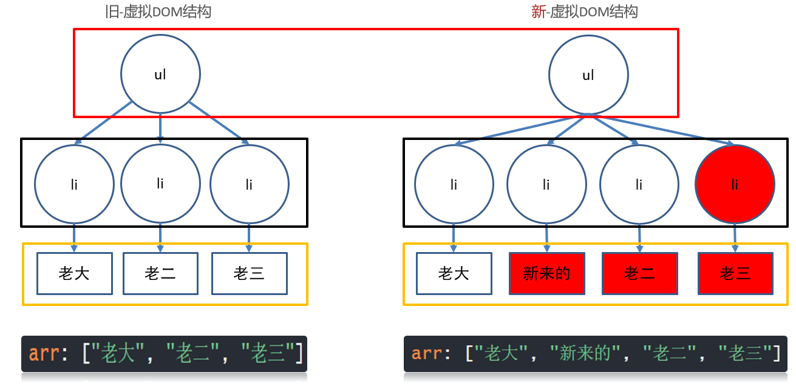

# Vue第二章

1. key作用, 虚拟DOM, diff算法
2. 设置动态样式
3. 过滤器, 计算属性, 侦听器

## 1_Vue2基础

### v-for数组更新监测

数组非变更方法, 返回新数组, 就不会导致v-for更新, 可采用覆盖数组或**this.$set()**

:::tip 数组更新监测

Vue 将以下被侦听的数组的变更方法进行了包裹也可以说加强，所以它们也将会触发视图更新`页面更新`。这些被包裹过的方法包括：

- `push()`
- `pop()`
- `shift()`
- `unshift()`
- `splice()`
- `sort()`
- `reverse()`


:::

非变更方法，例如 `filter()`、`concat()` 和 `slice()`。它们不会变更原始数组，而**总是返回一个新数组**。当使用非变更方法时，可以用新数组替换旧数组：

#### $set

vm.$set( target, propertyName/index, value )

- **参数**：

  - `{Object | Array} target`
  - `{string | number} propertyName/index`
  - `{any} value`

- **返回值**：设置的值。

- **用法**：

  这是全局 `Vue.set` 的**别名**。

- **参考**：[Vue.set](https://cn.vuejs.org/v2/api/#Vue-set)

> 注意: vue不能监测到数组里赋值的动作而更新, 如果需要请使用Vue.set() 或者this.$set(), 或者覆盖整个数组

> 总结:  改变原数组的方法才能让v-for更新

### 虚拟DOM

.vue文件中的template里写的标签, 都是模板, 都要被vue处理成虚拟DOM对象, 才会渲染显示到真实DOM页面上

1. 内存中生成一样的虚拟DOM结构(==本质是个JS对象==)

   因为真实的DOM属性好几百个, 没办法快速的知道哪个属性改变了

   比如template里标签结构

   ```html
   <template>
       <div id="box">
           <p class="my_p">123</p>
       </div>
   </template>
   ```

   对应的虚拟DOM结构

   ```js
   const dom = {
       type: 'div',
       attributes: [{id: 'box'}],
       children: {
           type: 'p',
           attributes: [{class: 'my_p'}],
           text: '123'
       }
   }
   ```

2. 以后vue数据更新

   * 生成新的虚拟DOM结构
   * 和旧的虚拟DOM结构对比
   * 利用diff算法, 找不不同, 只更新变化的部分(重绘/回流)到页面 - 也叫打补丁

:::tip 虚拟dom优势

1.  提高了更新DOM的性能(不用把页面全删除重新渲染)
2. 虚拟DOM只包含必要的属性(没有真实DOM上百个属性)


:::



### diff算法

vue用diff算法, 新虚拟dom, 和旧的虚拟dom比较

#### 情况1:

根元素变了, 删除重建 

旧虚拟DOM

```html
<div id="box">
    <p class="my_p">123</p>
</div>
```

新虚拟DOM

```html
<ul id="box">
    <li class="my_p">123</li>
</ul>
```

#### 情况2: 

根元素没变, 属性改变, ==元素复用==, 更新属性

旧虚拟DOM

```html
<div id="box">
    <p class="my_p">123</p>
</div>
```

新虚拟DOM

```html
<div id="myBox" title="标题">
    <p class="my_p">123</p>
</div>
```

### diff算法-key

#### 情况3: 

根元素没变, 子元素没变, 元素内容改变

**无key - 就地更新**

v-for不会移动DOM, 而是尝试复用, 就地更新，如果需要v-for移动DOM, 你需要用特殊 attribute `key` 来提供一个排序提示

```html
<ul id="myUL">
    <li v-for="str in arr">
        {{ str }} 
        <input type="text">
    </li>
</ul>
<button @click="addFn">下标为1的位置新增一个</button>
```

```js
export default {
    data(){
        return {
            arr: ["老大", "新来的", "老二", "老三"]
        }
    },
    methods: {
        addFn(){
            this.arr.splice(1, 0, '新来的')
        }
    }
};
```

旧 - 虚拟DOM结构  和  新 - 虚拟DOM结构 对比过程


> 性能不高, 从第二个li往后都更新了


#### key值为索引或者id

有key - 值为索引 

 - 还是就地更新

因为新旧虚拟DOM对比, key存在就复用此标签更新内容, 如果不存在就直接建立一个新的

```js
v-for="(str, index) in arr" :key="index"
```


:::danger 总结

**key的值有id用id, 没id用索引**

:::

**有key - 值为id** 

**key的值只能是唯一不重复的, 字符串或数值**

v-for不会移动DOM, 而是尝试复用, 就地更新，如果需要v-for移动DOM, 你需要用特殊 attribute `key` 来提供一个排序提示

新DOM里数据的key存在, 去旧的虚拟DOM结构里找到key标记的标签, 复用标签

新DOM里数据的key存在, 去旧的虚拟DOM结构里没有找到key标签的标签, 创建

旧DOM结构的key, 在新的DOM结构里没有了, 则==移除key所在的标签

```html
<template>
  <div>
    <ul>
      <li v-for="obj in arr" :key="obj.id">
        {{ obj.name }}
        <input type="text">
      </li>
    </ul>
    <button @click="btn">下标1位置插入新来的</button>
  </div>
</template>

<script>
export default {
  data() {
    return {
      arr: [
        {
          name: '老大',
          id: 50
        },
        {
          name: '老二',
          id: 31
        },
        {
          name: '老三',
          id: 10
        }
      ],
    };
  },
  methods: {
    btn(){
      this.arr.splice(1, 0, {
        id: 19, 
        name: '新来的'
      })
    }
  }
};
</script>

<style>
</style>
```


:::tip 总结

不用key也不影响功能(就地更新), 添加key可以提高更新的性能

:::


### v-bind:class

用v-bind给标签class设置动态的值

语法:

```
:class="{类名: 布尔值}"
使用场景: vue变量控制标签是否应该有类名
就是把类名保存在vue变量中赋予给标签
```

操作元素的 class 列表和内联样式是数据绑定的一个常见需求。因为它们都是 attribute，所以我们可以用 `v-bind` 处理它们：**只需要通过表达式计算出字符串结果即可**。不过，字符串拼接麻烦且易错。因此，在将 `v-bind` 用于 `class` 和 `style` 时，**Vue.js 做了专门的增强**。表达式结果的类型除了字符串之外，还可以是对象或数组。

动态class

:::tip 动态class

v-bind可以绑定属性,但是vue只给class 和 style 做增强.可以绑定对象和数组

:::

```html
<template>
	<div>
		<button @click="toggle">切换</button>
		<p :class="{ active: bool }">动态class</p>
	</div>
</template>
<script>
export default {
	data() {
		return {
			bool: true
		}
	},
	methods: {
		toggle() {
			this.bool = !this.bool
		}
	},
}
</script>
<style scoped>
.active {
	color: red;
}
</style>
```

上面的语法表示 `active` 这个 class 存在与否将取决于数据 property `isActive` 的 [Truthy（真值）](https://developer.mozilla.org/zh-CN/docs/Glossary/Truthy)


### v-bind:style

语法:

```
:style="{css属性: 值}"
 给标签动态设置style的值
 动态style的key都是css属性名
```


### 过滤器

可被用于一些常见的`文本格式化`

过滤器可以用在两个地方：`双花括号插值`和 `v-bind` 表达式

过滤器应该被添加在 `JavaScript 表达式的尾部`，

由“管道”符号指示：`|`

```html
<!-- 在双花括号中 -->
{{ obj.row.timeOfEntry | formatDate }}

<!-- 在 `v-bind` 中 -->
<div v-bind:id="rawId | formatId"></div>
```

注册全局的过滤器：

```js
import * as filters from '@/filters' // 引入工具类---过滤器
// 注册全局的过滤器
Object.keys(filters).forEach(key => {
  // 注册过滤器
  Vue.filter(key, filters[key])
})
```


### 为v-model提供计算属性computed

```html
<template>
  <div>
    <p>{{ num }}</p>
  </div>
</template>

<script>
//一个数据, 依赖另外一些数据计算而来的结果
export default {
  data(){
    return {
      a: 10,
      b: 20
    }
  },
  computed: {
    num(){
      return this.a + this.b
    }
  }
}
</script>
```

计算属性也是变量, 如果想要直接赋值, 需要使用完整写法

语法:

```js
computed: {
    "属性名": {
        set(值){
            
        },
        get() {
            return "值"
        }
    }
}
```


## 计算属性和侦听器

为什么要有computed计算属性?

Mustache (双大括号)模板内的表达式非常便利，但是设计它们的初衷是用于简单运算的。在模板中放入太多的逻辑会让模板过重且难以维护

:::tip tips

对于任何包含响应式数据的复杂逻辑，你都应该使用**计算属性**。 

:::


### 使用computed

**基本语法:**

```html
<p>{{ 计算属性名 }}</p>
```


```js
computed: {
    计算属性名 () {
        return  值 
    }
}
//computed是个对象,在里面定义属性,这个属性是个方法
```


```html
<template>
  <div>
    <p>{{ message }}</p>
    <!-- 使用js表达式 -->
    <p>{{ message.split('').reverse().join('') }}</p>
    <p>{{ message.split('').reverse().join('') }}</p>
    <p>{{ message.split('').reverse().join('') }}</p>

    <!-- 使用计算属性 -->
    <!-- reverseMSG 是不需要加()的 -->
    <p>{{ reverseMSG }}</p>
    <p>{{ reverseMSG }}</p>
    <p>{{ reverseMSG }}</p>

    <!-- 使用 methods  -->
    <p>{{ reverseMessage() }}</p>
    <p>{{ reverseMessage() }}</p>
    <p>{{ reverseMessage() }}</p>
    <button  @click="message='你好'">改变message</button>
  </div>
</template>

<script>
export default {
  data() {
    return {
      message: "hello",
      age: 0
    };
  },
  // 你可以像普通属性一样将数据绑定到模板中的计算属性。
  // Vue 知道 reverseMSG 依赖于 message
  // 因此当 message 发生改变时，所依赖的计算属性 reverseMSG 的绑定也会更新。
  // 而且最妙的是我们以声明的方式创建了这个依赖关系：
  // 计算属性的 getter 函数没有副作用，它更易于测试和理解
  computed: {
    //计算属性 reverseMSG 会有一个依赖值 message
    //当依赖值 message 不改变 ,reverseMSG 就不会重新计算
    //因为依赖值message会有一个缓存,当再次调用后,就不会再计算了
    reverseMSG: function() {
      console.log('计算属性');
      return this.message
        .split("")
        .reverse()
        .join("");
    }
    // reverseMSG () {
    // 	return this.message.split('').reverse().join('')
    // }
  },
  methods: {
    reverseMessage: function() {
      console.log('methods');

      return this.message
        .split("")
        .reverse()
        .join("");
    }
  }
  //计算属性缓存 vs 方法

  // 我们可以将同样的函数定义为一个方法，而不是一个计算属性。
  // 从最终结果来说，这两种实现方式确实是完全相同的。
  // 然而，不同的是计算属性将基于它们的响应依赖关系缓存。
  // 计算属性只会在相关响应式依赖发生改变时重新求值。
  // 这就意味着只要 message 还没有发生改变，
  // 多次访问 reverseMSG 时计算属性会立即返回之前的计算结果，而不必再次执行函数
  // 所以 computed 相对于 methods 会大大提高性能
};
</script>
```


### 计算属性完整写法

计算属性也是变量, 如果想要直接赋值, 需要使用完整写法

```js
computed: {
    "属性名": {
        set(值){
            
        },
        get() {
            return "值"
        }
    }
}
```


## 侦听器Watch

**虽然计算属性在大多数情况下更合适，但有时也需要一个自定义的侦听器。这就是为什么 Vue 通过 `watch` 选项提供了一个更通用的方法，来响应数据的变化。当需要在数据变化时执行异步或开销较大的操作时，这个方式是最有用的。**

**Vue 提供了一种更通用的方式来观察和响应 Vue 实例上的数据变动：侦听属性。当你有一些数据需要随着其它数据变动而变动时，你很容易滥用 `watch`。然而，通常更好的做法是使用计算属性而不是命令式的 `watch` 回调。细想一下这个例子：**

> 侦听data/computed属性值改变

语法：

```js
watch: {
    "被侦听的属性名" (newVal, oldVal){
        
    }
}
```

```html
<template>
  <div>
    <input type="text" v-model="name">
  </div>
</template>

<script>
export default {
  data(){
    return {
      name: ""
    }
  },
  // 目标: 侦听到name值的改变
  /*
  语法:
    watch: {
      变量名 (newVal, oldVal){
        // 变量名对应值改变这里自动触发
      }
    }
  */
  watch: {
    // newVal: 当前最新值
    // oldVal: 上一刻值
    name(newVal, oldVal){
      console.log(newVal, oldVal);
    }
  }
}
</script>
```

### 深度侦听和立即执行 

> 目标: 侦听复杂类型, 或者立即执行侦听函数

```js
watch: {
    "要侦听的属性名": {
        immediate: true, // 立即执行
        deep: true, // 深度侦听复杂类型内变化
        handler (newVal, oldVal) {
       
        }
    }
}
```

```html
<template>
  <div>
    <input type="text" v-model="user.name">
    <input type="text" v-model="user.age">
  </div>
</template>

<script>
export default {
  data(){
    return {
      user: {
        name: "",
        age: 0
      }
    }
  },
  // 目标: 侦听对象
  /*
  语法:
    watch: {
      变量名 (newVal, oldVal){
        // 变量名对应值改变这里自动触发
      },
      变量名: {
        handler(newVal, oldVal){

        },
        deep: true, // 深度侦听(对象里面层的值改变)
        immediate: true // 立即侦听(网页打开handler执行一次)
      }
    }
  */
  watch: {
    user: {
      handler(newVal, oldVal){
        // user里的对象
        console.log(newVal, oldVal);
      },
      deep: true,
      immediate: true
    }
  }
}
</script>
```

> 总结: immediate立即侦听, deep深度侦听, handler固定方法触发


## DataProperty

### data

组件的 `data` 选项是一个函数

它应该返回一个对象

### methods

我们用 `methods` 选项向组件实例添加方法，它应该是一个包含所需方法的对象：

:::tip methods

Vue 自动为 `methods` 绑定 `this`，以便于它始终指向组件实例。这将确保方法在用作事件监听或回调时保持正确的 `this` 指向。在定义 `methods` 时应避免使用箭头函数，因为这会阻止 Vue 绑定恰当的 `this` 指向

:::