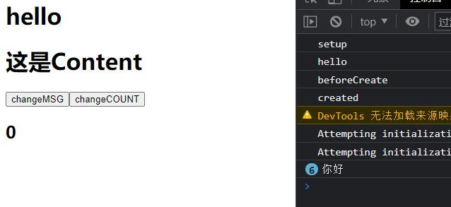
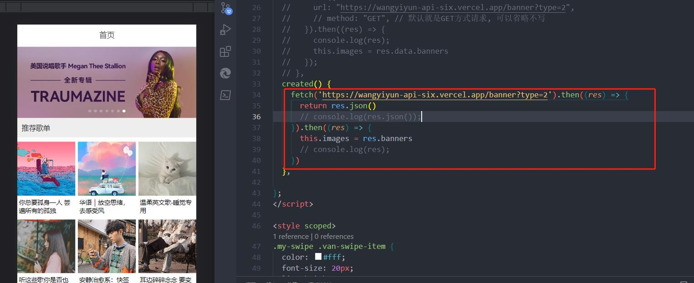

# Vue3Composition-API

## setup

**组合式API**  **将同一个逻辑关注点相关代码收集在一块**

组件创建之前被执行，不需要使用this

:::tip TIP

setup 是围绕beforeCreate 和created 生命周期运行的，所以不需要显示的定义它们，换句话说，在这些钩子函数中编写的任何代码都应该直接在setup 函数中编写

在setup中你应该避免使用this,因为它不会找到组件实例. setup 的调用发生在date, computed 或 methods被解析之前,所以它们无法在setup中被获取

:::

```js
  setup() {
    console.log('setup');
    let msg = 'hello'
    console.log(msg);
    function changeMSG() {
      msg = '你好'
      console.log(msg);//数据不是响应式
    }
    return { msg, changeMSG }
  },
```

```html
    <button @click="changeMSG">changeMSG</button>

```



### setup响应式

### 带ref的响应式变量


```html
    <!-- 模板自动解析value值 -->
    <h2>{{count}}</h2>
```


```js
  setup() {
    console.log('setup');
    let msg = 'hello'
    console.log(msg);
    function changeMSG() {
      msg = '你好'
      console.log(msg);//数据不是响应式
    }
    // ref定义响应式变量
    // highlight-next-line
    // ref函数返回带有value属性的对象
    // highlight-next-line
    const count = ref(0);
    function changeCOUNT() {
      count.value++
    }
    // highlight-next-line
    return { msg, changeMSG, count, changeCOUNT }//在setup里定义的变量一定要暴露出去
  },
```

ref 接收一个参数并将其包裹在一个带有`value` property的对象中返回，然后可以使用该 property访问或更改响应式变量的值

:::tip TIP

将值封装在一个对象中，看似没必要，但为了保持JavaScript中不同数据类型的行为统一，这是必须的，这是因为在JavaScript中，Number 或 String 等基本类型通过值 而非引用传递的

换句话说，ref 为我们的值创建了一个**响应式引用**，在整个组合式API 中会经常使用**引用**的概念

:::

### 那如果想定义一个引用数据类型呢？reactive，而不是ref了

通过reactive定于引用类型的数据

```js
import { ref ,reactive } from 'vue';

```

```js
    const obj = reactive({
      name: 'xxx',
      age: 20
    })
```

`...obj` **解构会失去响应性**

```js
return { msg, changeMSG, count, changeCOUNT ,...obj}
```

### toRefs让解构后的数据重新获得响应式

```js
return { msg, changeMSG, count, changeCOUNT, ...toRefs(obj)，name }
```

```js
let {name,children} = toRefs(obj)
```

### 在setup中使用watch和watchEffect

过去的选项式API

```js
  data() {
    return {
      message: '你好',
    };
  },
  //选项式API
  watch: {
    message: function (newVal, oldVal) {

    }
  },
```

watch响应式更改

它接收3个参数：

- 一个想要侦听的 响应式引用 或 getter函数
- 一个回调
- 可选的配置选项

```js
import { watch } from 'vue';
```

```html
<template>
  <div>
    <h2>{{ counter }}</h2>
    <button @click="changeCounter">改变counter</button>
    <h2>{{ user.name }}</h2>
    <button @click="changeUser">改变use的名字</button>
  </div>
</template>

<script>
import { ref, reactive, toRefs, watch, watchEffect } from 'vue';
export default {
  setup() {
    const counter = ref(0)
    function changeCounter() {
      counter.value++
    }
    const user = reactive({
      name: 'KEVIN',
      age: 20,
    })
    function changeUser() {
      user.name = 'KKKKK'
    }
    //侦听counter
    // highlight-next-line
    //watch(侦听的响应式引用,回调函数)
    // highlight-next-line 
    watch(counter, (newVal, oldVal) => {
      console.log('新值-----', newVal);
      console.log('旧值-----', oldVal);

    })
    // highlight-start
    //watchEffect(回调函数)
    //不需要指定监听的属性，组件初始化的时候会执行一次回调函数
    //自动收集依赖
    watchEffect(() => {
      console.log(user.name);
    })
    //watch 和 watchEffect 区别
    // 1—— watchEffect不需要指定监听的属性，自动收集依赖，只要在回调中引用到了响应式的属性，回调就会执行
    // 2—— watch只能侦听指定的属性
    // highlight-end

    return { counter, user, changeCounter, changeUser }
  },
};
</script>
```

### 在setup中使用computed

```html
<script>
import { computed, ref, reactive, toRefs, watch, watchEffect, } from 'vue';
export default {
  data() {
    return {
      message: 'hello'
    }
  },
  setup() {
    const msg = ref('hello------')
    const reverseMSG = computed(() => {//返回一个带有value属性的对象
      return msg.value.split('').reverse().join('')
    })
    console.log(reverseMSG.value);


    //在对象里
    const user = reactive({
      name: 'KEVIN',
      age: 20,
      reverseMSG: computed(() => {
        return msg.value.split('').reverse().join('')
      })
    })
    console.log(user.reverseMSG);
  },
    
  //对比选项式API
  computed: {
    reverseMSG: function () {
      return this.message.split('').reverse().join('')
    }
  }
};
</script>

```

### setup第二个参数context

`context`是一个普通的JavaScript对象。暴露了其他可能在setup中有用的值

传入 `setup` 函数的第二个参数是一个 **Setup 上下文**对象。上下文对象暴露了其他一些在 `setup` 中可能会用到的值：

```js
export default {
  setup(props, context) {
    // 透传 Attributes（非响应式的对象，等价于 $attrs）
    console.log(context.attrs)

    // 插槽（非响应式的对象，等价于 $slots）
    console.log(context.slots)

    // 触发事件（函数，等价于 $emit）
    console.log(context.emit)

    // 暴露公共属性（函数）
    console.log(context.expose)
  }
}
```

`context`是一个普通的`JavaScript`对象。也就是说，它不是非响应式的，这意味着你可以安全的对`context` 使用`ES6`解构：

```js
export default {
  setup(props, { attrs, slots, emit, expose }) {
    ...
  }
}
```

### setup访问以下的property

执行setup时，你只能访问以下property：

- props
- attrs
- slots
- emit

换句话说，你将无法访问以下组件选项：

- data
- computed
- methods
- refs

### script setup 语法糖

```html
<template>
  <div>
    <Content />
    <h2>A值为: {{ A }}</h2>
    <button @click="changeA">改变A</button>
  </div>
</template>

<script setup>
// 引入组件不需要注册、和React一样
import Content from './Content.vue'
// 定义变量，在模板中不需要暴露出去，模板直接使用
// 定义响应式的变量，还是需要从vue中引入
import { ref } from 'vue'
const A = ref(20);
function changeA() {
  A.value++
}
</script>

```

## 使用fetch获取数据

```js
  created() {
    fetch('https://wangyiyun-api-six.vercel.app/banner?type=2').then((res) => {
      return res.json()
      // console.log(res.json());
    }).then((res) => {
      this.images = res.banners
      // console.log(res);
    })
  },
```




## 组件

通过 `<script setup>`，导入的组件都在模板中直接可用。

```html
<script setup>
import ButtonCounter from './ButtonCounter.vue'
</script>

<template>
  <h1>Here is a child component!</h1>
  <ButtonCounter />
</template>
```

### 传递props

```html
<!-- BlogPost.vue -->
<script setup>
defineProps(['title'])
</script>

<template>
  <h4>{{ title }}</h4>
</template>
```

如果你没有使用 `<script setup>`，props 必须以 `props` 选项的方式声明，props 对象会作为 `setup()` 函数的第一个参数被传入：

```js
export default {
  props: ['title'],
  setup(props) {
    console.log(props.title)
  }
}
```

```html
<BlogPost title="My journey with Vue" />
<BlogPost title="Blogging with Vue" />
<BlogPost title="Why Vue is so fun" />
```

```html
<BlogPost
  v-for="post in posts"
  :key="post.id"
  :title="post.title"
 />
```

