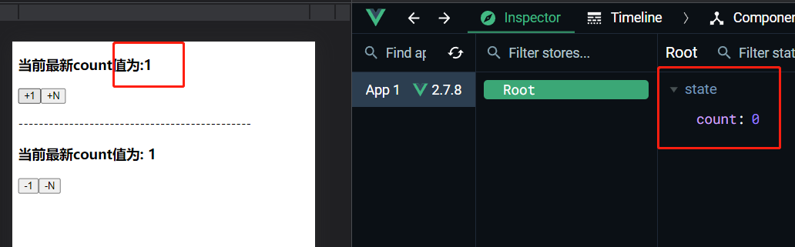
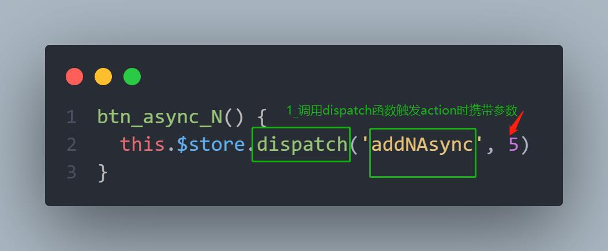
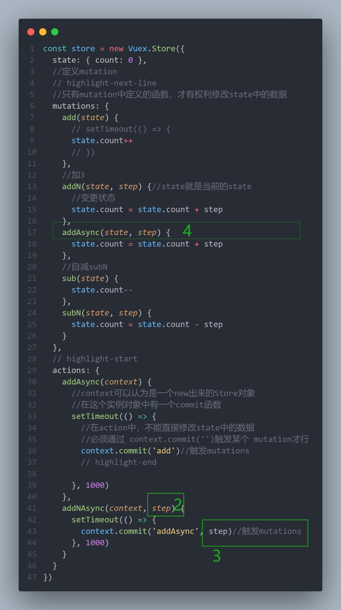

# Vuex3

## state

**State提供唯一的公共数据源**，**所有共享的数据都要统一放到Store的State中进行存储**

```js
import Vue from 'vue'
import App from './App-1.vue'
import Vuex from 'vuex'
// import Vant from 'vant';
// import 'vant/lib/index.css';
// import 'amfe-flexible'
// Vue.use(Vant);//vant组件库
Vue.use(Vuex)//vuex状态管理
Vue.config.productionTip = false
//创建store对象
const store = new Vuex.Store({
  state: { count: 0 }
})
new Vue({
  //将store对象挂载到vue实例中
  //所有的组件可以直接从store中获取全局的数据
  store,
  render: h => h(App)
}).$mount('#app')

```


组件访问State中数据的第一种方式：通过插值表达式

```js
this.$store.state.全局数据名称
<h3>当前最新count值为: {{this.$store.state.count}}</h3>

```

组件访问State中数据的第二种方式：mapState 辅助函数


```js
//按需导入mapState 函数
import { mapState } from 'vuex'
mapState(['count']) 

```

通过导入的mapState 函数 ，将当前组件需要的全局数据，映射为当前组件的cpmputed计算属性

```html

<template>
  <div>
    <h3>当前最新count值为: {{count}}</h3>
    <button>-1</button>
  </div>
</template>
// highlight-next-line
<!-- 将全局数据，映射为当前组件的计算属性 -->
<script>
import { mapState } from 'vuex'
export default {
  computed: {
    ...mapState(['count'])
    //利用展开运算符将导出的状态映射给计算属性
  },
};
</script>
```


等价于：

```js
export default {
  computed: {
    // ...mapState(['count'])
    //利用展开运算符将导出的状态映射给计算属性
    count() {
      return this.$store.state.count
    }
  },
};
```


## Mutation

**Mutation用于修改Store中的数据**

1. 只能通过mutation变更Store中的数据，不可以直接操作Store中的数据
2. 通过mutation 方式可以集中监控所有数据的变化

不推荐直接修改State

```html
<template>
  <div>
    <h3>当前最新count值为:{{ this.$store.state.count }}</h3>
    <button @click="btn">+1</button>
  </div>
</template>
<script>
export default {
  methods: {
    btn() {
      this.$store.state.count++
    }
  },
};
</script>
```

第一种方式：this.$store.commit(  )

正确的操作：定义mutation

```js
const store = new Vuex.Store({
  state: { count: 0 },
  //定义mutation
  mutations: {
    // highlight-next-line
    add(state) {//state就是当前的state
      //变更状态
      state.count++
    }
  }
})
```

正确的操作：触发mutation

```html
<template>
  <div>
    <h3>当前最新count值为:{{ this.$store.state.count }}</h3>
    <button @click="btn">+1</button>
  </div>
</template>
<script>
export default {
  methods: {
    btn() {
      this.$store.commit('add')
    }
  },
};
</script>
```


### 传递参数

可以在触发 `mutations` 时传递参数

```js
//创建store对象
const store = new Vuex.Store({
  state: { count: 0 },
  //定义mutation
  mutations: {
    // add(state) {//state就是当前的state
    //   //变更状态
    //   state.count++
    // }
    addN(state ,step) {//state就是当前的state
      //变更状态
      state.count = state.count +step
    }
  }
})
```


```js
export default {
  methods: {
    // btn() {
    //   this.$store.commit('add')
    // }
    btn() {
      this.$store.commit('addN',3)
    }
  },
};
```

### 第二种触发方式

this.$store.commit('   ')是第一种触发mutations 的方式，触发mutations 的第二种方式

```js
import {mapState, mapMutations } from 'vuex'

```

```js
...mapMutations(['sub','subN']),
```

```js
// main.js
const store = new Vuex.Store({
  state: { count: 0 },
  //定义mutation
  mutations: {
    //自增
    add(state) {//state就是当前的state
      //变更状态
      state.count++
    },
    //加3
    addN(state, step) {//state就是当前的state
      //变更状态
      state.count = state.count + step
    },
    //自减subN
    sub(state) {
      state.count--
    },
    subN(state ,step) {
      state.count = state.count - step
    }
  }
})
```


```html
<template>
  <div>
    <h3>当前最新count值为:{{ this.$store.state.count }}</h3>
    <button @click="btn">+1</button>
    <button @click="btnN">+N</button>

  </div>
</template>
<script>
export default {
  methods: {
    btn() {
      this.$store.commit('add')
    },
    btnN() {
      this.$store.commit('addN',3)
    },

  },
};
</script>
```


```html
<template>
  <div>
    <h3>当前最新count值为: {{ count }}</h3>
    <button @click="subBTN_1">-1</button>
    <button @click="subBTN_2">-N</button>

  </div>
</template>
<script>
import { mapState, mapMutations } from 'vuex'

export default {
  computed: {
    ...mapState(['count']),
  },
  methods: {
    ...mapMutations(['sub', 'subN']),
    // highlight-next-line
    //将全局 mutations 的sub 映射为当前组件的一个methods
    subBTN_1() {
      this.sub()
    },
    subBTN_2() {
      this.subN(3)
    },

  },
};
</script>
```

## Action

**不要在 mutations 函数中,执行异步操作**

```js
  mutations: {
    //自增
    // highlight-next-line
    // 不要在 mutations 函数中,执行异步操作
    add(state) {
      setTimeout(() => {
        state.count++
      })
    },
 }
```



Action用于处理异步任务

如果通过异步任务变更数据，必须通过Action 而不能使用mutation  ，**但是Action中还是要通过触发mutation的方式间接变更数据**


```js
const store = new Vuex.Store({
  state: { count: 0 },
  //定义mutation
  // highlight-next-line
  //只有mutation中定义的函数，才有权利修改state中的数据
  mutations: {
    add(state) {
      // setTimeout(() => {
      state.count++
      // })
    },
    //加3
    addN(state, step) {//state就是当前的state
      //变更状态
      state.count = state.count + step
    },
    //自减subN
    sub(state) {
      state.count--
    },
    subN(state, step) {
      state.count = state.count - step
    }
  },
  // highlight-start
  actions: {
    addAsync(context) {
      //context可以认为是一个new出来的Store对象
      //在这个实例对象中有一个commit函数
      setTimeout(() => {
        //在action中，不能直接修改state中的数据
        //必须通过 context.commit('')触发某个 mutation才行
        context.commit('add')//触发mutations
        // highlight-end

      }, 1000)
    }
  }
})
```


```js
export default {
  methods: {
    btn() {
      this.$store.commit('add')
    },
    btnN() {
    // highlight-next-line
      //commit专门用来触发mutation
      this.$store.commit('addN', 3)
    },
    //异步的让 count 自增 +1 
    btn_async() {
      // highlight-next-line
      //dispatch专门用来触发action
      this.$store.dispatch('addAsync')
    }
  },
};
```


### 携带参数

触发action异步任务时携带参数






```js
    btn_async_N() {
      this.$store.dispatch('addNAsync', 5)
    }
```


```js
const store = new Vuex.Store({
  state: { count: 0 },
  //定义mutation
  // highlight-next-line
  //只有mutation中定义的函数，才有权利修改state中的数据
  mutations: {
    add(state) {
      // setTimeout(() => {
      state.count++
      // })
    },
    //加3
    addN(state, step) {//state就是当前的state
      //变更状态
      state.count = state.count + step
    },
    // highlight-next-line
    addAsync(state, step) {
      state.count = state.count + step
    },
    //自减subN
    sub(state) {
      state.count--
    },
    subN(state, step) {
      state.count = state.count - step
    }
  },
  // highlight-start
  actions: {
    addAsync(context) {
      //context可以认为是一个new出来的Store对象
      //在这个实例对象中有一个commit函数
      setTimeout(() => {
        //在action中，不能直接修改state中的数据
        //必须通过 context.commit('')触发某个 mutation才行
        context.commit('add')//触发mutations
        // highlight-end

      }, 1000)
    },
    // highlight-next-line
    addNAsync(context, step) {
      setTimeout(() => {
        // highlight-next-line
        context.commit('addAsync', step)//触发mutations
      }, 1000)
    }
  }
})
```


### 第二种触发方式

```js
    subAsync(context) {
      setTimeout(() => {
        // highlight-next-line
        context.commit('sub')//触发mutations
      }, 1000)
    }
```

```js
...mapActions(['subAsync']),
//将全局的 subAsync 映射为当前组件的一个methods
```

```html
<button @click="subAsync">-1 Async</button>
```

-N 

```js
    subN_Async(context ,step) {
      setTimeout(() => {
        // highlight-next-line
        context.commit('subN',step)//触发mutations
      }, 1000)
    }
```

```js
...mapActions(['subAsync','subN_Async']),
```

```html
<button @click="subN_Async(5)">-N Async</button>

```


## Getter

Getter用于对Store中的数据进行加工处理形成新的数据

Getter不会修改store的原数据，只起包装的作用

1. Getter可以对Store中的已有的数据加工处理之后形成新的数据，类似Vue 的计算属性
2. Store中数据发生变化，Getter的数据也会跟着变化

```js
const store = new Vuex.Store({
  getters: {
    showNum: state => {
      return `当前最新的数量是 ${state.count}`
    }
  },
  state: { count: 0 },
}
```

使用getters 的第一种方式

```js
this.$state.getters.showNum
```

```html
<h3>当前最新count值为:{{ this.$store.getters.showNum }}</h3>
```

使用getters 的第二种方式

```js
import { mapGetters } from 'vuex'

computed:{
	...mapGetters(['showNum'])	
}
```

```html
<h3>当前最新count值为: {{ showNum }}</h3>
```


